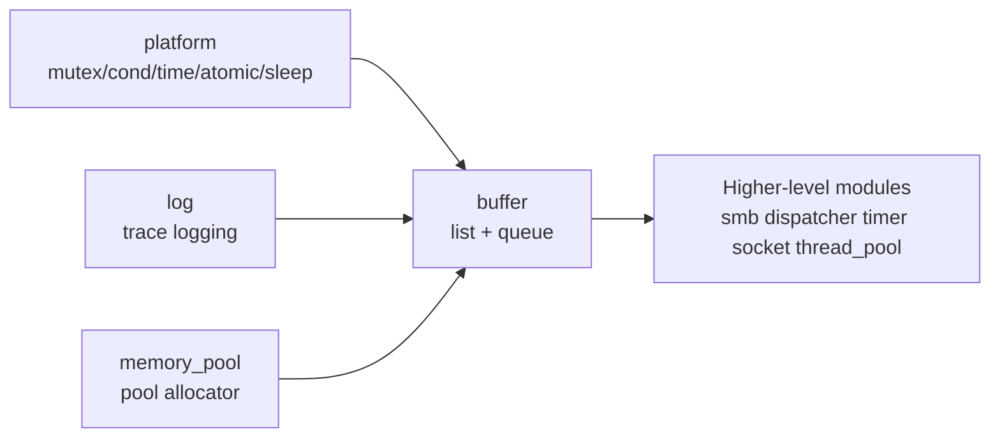
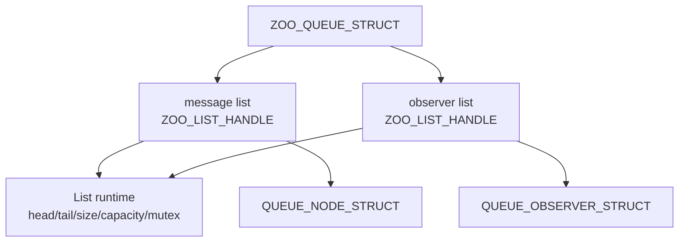
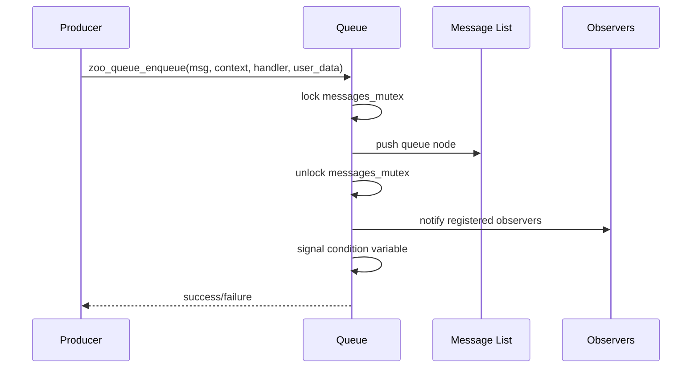
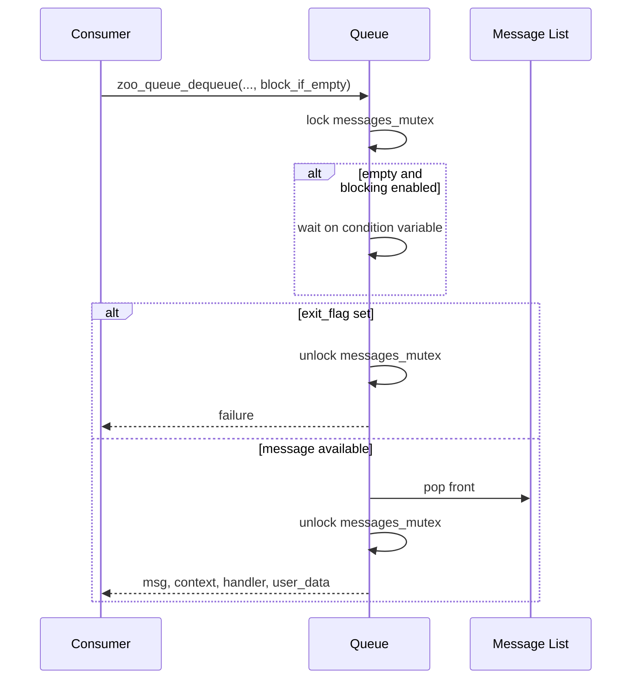
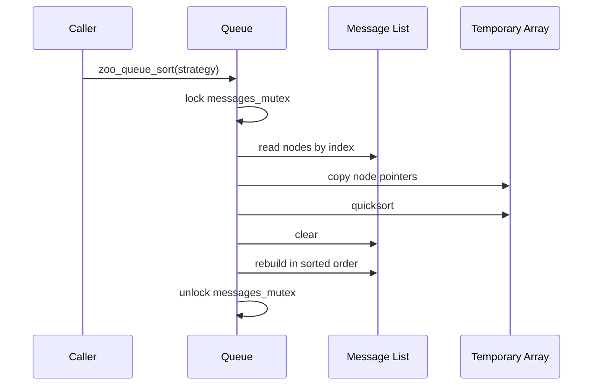

# ZOO Buffer Module Architecture

## 1. Purpose

This document describes the architectural role of the ZOO buffer module, its internal component relationships, and its dependency boundaries inside the wider ZOO workspace.

## 2. Architectural Role

The buffer module is a foundational utility module. It sits below feature modules and provides reusable in-memory buffering primitives that other modules can compose for:

- Work queues
- Deferred callback dispatch
- Observer fan-out bookkeeping
- Pointer-ordered transient storage

It is not itself a transport, dispatcher, or persistence layer. It is a low-level data-structure module with synchronization support.

## 3. Module Context

At workspace level, the buffer module depends on common ZOO infrastructure rather than the other way around.

Key dependency directions:

- `zoo_list` depends on platform and error abstractions.
- `zoo_queue` depends on `zoo_list`, platform, logging, and memory pool.
- Higher-level modules may depend on buffer, but buffer does not depend on them.

## 4. Internal Component View

The buffer module contains two primary runtime components.

### 4.1 List Component

Responsibilities:

- Maintain bounded ordered storage of payload pointers
- Provide thread-safe access and mutation
- Expose common container operations through an opaque handle

### 4.2 Queue Component

Responsibilities:

- Maintain bounded ordered storage of message records
- Support producer-consumer synchronization
- Support optional observer notification on enqueue
- Support post-enqueue ordering by priority or timestamp

### 4.3 Composition Diagram

Architecturally, the queue is a composite built on top of generic list services. The queue adds its own synchronization and control state around those lists.

## 5. Runtime Interaction Model

### 5.1 Enqueue Path

Important architectural note: observer notification runs after the message is already committed to the queue.

### 5.2 Dequeue Path

### 5.3 Sort Path

## 6. Concurrency Architecture

The module uses a layered synchronization model.

### 6.1 Synchronization Objects

- Each list instance owns one mutex.
- Each queue instance owns two mutexes and one condition variable.
- Each queue instance also owns an atomic shutdown flag.

### 6.2 Locking Boundaries

- List operations protect list-local invariants.
- Queue operations protect queue-level workflows and then call into list APIs that protect list-local state.
- Observer registration and observer iteration are isolated from message operations by a dedicated mutex.

### 6.3 Architectural Implications

- The design is safe for concurrent use but not minimal in lock depth.
- The queue relies on list internals for storage safety instead of taking direct ownership of node linkage logic.
- The module prioritizes reuse and portability over lock-elision optimization.

## 7. Data Ownership Architecture

The module follows a wrapper-node ownership pattern.

- The module owns list nodes, queue nodes, observer records, and control blocks.
- The caller owns the payload pointers stored inside those nodes.

This is a deliberate boundary choice. It keeps the module generic and avoids payload-copy assumptions, but it also means payload lifetime bugs must be prevented by higher layers.

## 8. Portability Architecture

The architecture is intentionally built on ZOO abstractions from [platform/inc/zoo.h](/home/mozeat/zoo/platform/inc/zoo.h) instead of binding directly to pthread or a single RTOS API.

Abstracted facilities used by the module include:

- mutex initialization, lock, unlock, destroy
- condition variable initialization, wait, signal, broadcast, destroy
- atomic boolean state
- timestamp acquisition
- sleep utilities

This allows the same buffer logic to remain portable across the target environments declared by the module build configuration.

## 9. Structural Constraints

1. The list is singly linked, so tail removal remains linear.
2. Queue priority is metadata on queue wrapper nodes rather than part of payloads.
3. Queue sorting is an explicit maintenance operation, not an always-sorted insertion strategy.
4. Observer storage is bounded by a fixed internal capacity.
5. Queue shutdown is sticky because `exit_flag` is not reset.

## 10. Architectural Risks and Follow-up Areas

The current architecture is serviceable and compact, but there are clear future improvement points:

1. Replace layered queue-plus-list locking with a flatter storage strategy if contention becomes measurable.
2. Add timed dequeue and observer removal if the queue becomes a long-lived subsystem primitive.
3. Consider a stable ordering strategy if equal-priority fairness matters.
4. Consider a doubly linked list if `pop_back` or erase-heavy workloads become important.
5. Clarify zero-capacity queue semantics at API level to avoid ambiguity for integrators.

## 11. Documented Source Boundaries

Primary implementation sources:

- [buffer/src/zoo_list.c](/home/mozeat/zoo/buffer/src/zoo_list.c)
- [buffer/src/zoo_queue.c](/home/mozeat/zoo/buffer/src/zoo_queue.c)

Primary public interfaces:

- [buffer/inc/zoo_list.h](/home/mozeat/zoo/buffer/inc/zoo_list.h)
- [buffer/inc/zoo_queue.h](/home/mozeat/zoo/buffer/inc/zoo_queue.h)