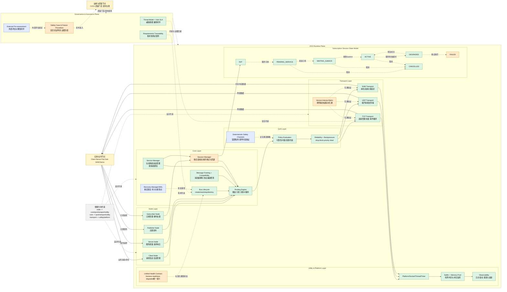

# ZOO SMB 架构图（现状与规划）

## 图例

- 绿色：已实现
- 橙色：部分实现
- 蓝色：未来规划
- 黄色：外部节点
- 灰色虚线：治理与证据流

## 架构图

## 功能状态说明

- 已实现：Node 分层（Client/Server/Publisher/Subscriber）、生命周期与路由、消息编解码与兼容检查、TCP/UDP/SHM 传输、策略评估与回压、有界内存与可观测性。
- 部分实现：Session Manager 多会话协调、跨传输协议版本互通验证、统一健康语义、安全证据流程落地执行。
- 未来实现：恢复管理（WAL/Checkpoint）、确定性安全通道、外部预评估与整改闭环。
