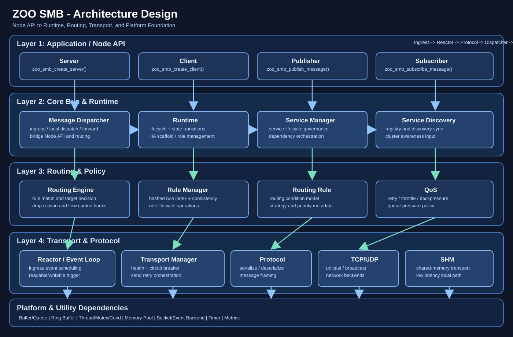

# ZOO Soft Message Bus (SMB)

## Overview

ZOO SMB is a layered message bus library for embedded and system software scenarios. The external API is node-oriented (`server`, `client`, `publisher`, `subscriber`) and routes messages through a shared core bus, rule engine, and transport stack.

This README reflects the current architecture and API shape after remediation.

## Architecture (Reviewed)

### Layered view

1. **Application / Node API**
     - `zoo_smb_create_server()` / `zoo_smb_create_client()`
     - `zoo_smb_create_publisher()` / `zoo_smb_create_subscriber()`

2. **Core bus & runtime**
     - Node registration and message routing
     - Runtime lifecycle + HA scaffolding (`runtime` module)

3. **Routing / rule / transport management**
     - Rule resolution and dispatch
     - Transport health and retry policies

4. **Transport backends + protocol**
     - TCP / UDP / UDP-broadcast / SHM
     - message serialize/deserialize

5. **Platform dependencies**
     - thread/mutex/cond, memory pool, ring buffer, socket/event backend

### Architecture diagram



### Module map

- Public headers:
    - [inc/node](inc/node)
    - [inc/core](inc/core)
    - [inc/transport](inc/transport)
    - [inc/qos](inc/qos)
    - [inc/utility](inc/utility)
- Implementations:
    - [src/node](src/node)
    - [src/core](src/core)
    - [src/transport](src/transport)
    - [src/qos](src/qos)
    - [src/utility](src/utility)

## Documentation

- Requirements: [docs/SMB_REQUIREMENTS.md](docs/SMB_REQUIREMENTS.md)
- Design: [docs/SMB_DESIGN.md](docs/SMB_DESIGN.md)
- Architecture: [docs/SMB_ARCHITECTURE.md](docs/SMB_ARCHITECTURE.md)
- QoS Performance Review: [docs/SMB_QOS_PERFORMANCE_REVIEW.md](docs/SMB_QOS_PERFORMANCE_REVIEW.md)
- Code Spec Compliance Checklist: [docs/SMB_CODE_SPEC_COMPLIANCE_CHECKLIST.md](docs/SMB_CODE_SPEC_COMPLIANCE_CHECKLIST.md)
- Function Comment Audit: [docs/SMB_FUNCTION_COMMENT_AUDIT.md](docs/SMB_FUNCTION_COMMENT_AUDIT.md)
- Legacy combined architecture/design: [docs/SMB_ARCHITECTURE_DESIGN.md](docs/SMB_ARCHITECTURE_DESIGN.md)

## Current external API conventions

- **Do use (public node/core API)**
    - `zoo_smb_create_server()`, `zoo_smb_server_set_message_handler()`, `zoo_smb_server_send_reply()`
    - `zoo_smb_create_client()`, `zoo_smb_client_send_request()`, `zoo_smb_client_recv_reply()`
    - `zoo_smb_create_publisher()`, `zoo_smb_publish_message()`
    - `zoo_smb_create_subscriber()`, `zoo_smb_subscribe_message()`

- **Do not use as app lifecycle API**
    - `zoo_smb_service_create/start/stop/...` (these are not the external node API entrypoints)

## Build

### Dependencies

- CMake 3.14+
- C compiler with C11 support

### Commands

```bash
bash build.sh           # Normal build (ZOO_SMB_AUTO_INIT=ON)
bash build.sh test      # Test build (ZOO_SMB_AUTO_INIT=OFF)
```

## Test

```bash
# Run all tests
./run_test.sh

# Run only unit and integration tests
./run_test.sh unit integration

# Run tests in parallel
./run_test.sh --parallel

# Skip optional tests
./run_test.sh --skip-optional

# Custom build and report directory
./run_test.sh --build-dir mybuild --report-dir myreports

# Show help
./run_test.sh --help
```

## Example benchmarks

```bash
# Run SMB example benchmarks 1-4 separately and generate a clean summary
./run_example_benchmarks.sh

# Override timeout or report directory if needed
TEST_TIMEOUT=300 REPORT_DIR=reports ./run_example_benchmarks.sh
```

## Minimal server example (current API)

```c
#include "zoo_smb_server.h"
#include <stdio.h>
#include <string.h>

static int server_message_handler(
        void* user_data,
        uint32_t msg_id,
        uint64_t request_id,
        uint64_t timestamp,
        const char* sender,
        const void* payload,
        size_t payload_size)
{
        ZOO_SMB_SERVER_HANDLE server = (ZOO_SMB_SERVER_HANDLE)user_data;
        (void)timestamp;
        (void)payload;
        (void)payload_size;

        const char* reply_msg = "Server received your request!";
        size_t reply_size = strlen(reply_msg);
        zoo_smb_server_send_reply(server, sender, msg_id, reply_msg, reply_size, request_id);
        return ZOO_SMB_OK;
}

int main(void)
{
        ZOO_SMB_SERVER_HANDLE server = zoo_smb_create_server(
                "DemoServer",
                "localhost",
                "DemoTopic",
                ZOO_SMB_TRANSPORT_TYPE_DEFAULT,
                NULL);

        zoo_smb_server_set_message_handler(server, server_message_handler, server);
        getchar();
        zoo_smb_destroy_server(server);
        return 0;
}
```

## Notes

- Remediation details: [ARCHITECTURE_REMEDIATION_REPORT.md](ARCHITECTURE_REMEDIATION_REPORT.md)
- Runtime/HA implementation summary: [HA_IMPLEMENTATION_COMPLETE.md](HA_IMPLEMENTATION_COMPLETE.md)
- Additional verification docs: [COMPREHENSIVE_TEST_DOCUMENTATION.md](COMPREHENSIVE_TEST_DOCUMENTATION.md)

## License

This project is licensed under the company internal license. See [LICENSE](LICENSE).