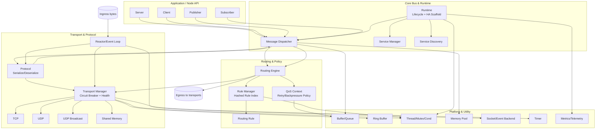

# ZOO SMB 架构设计文档

## 1. 文档目的

本文档描述 ZOO SMB（Soft Message Bus）模块的分层架构、核心组件职责、关键数据流与设计约束，用于：

- 架构评审与跨团队对齐
- 新成员快速理解系统边界
- 后续性能优化、HA 建设与可观测性改造的基线

## 2. 设计目标

- 支持 Node API（server/client/publisher/subscriber）统一接入
- 提供可扩展的消息路由与规则匹配能力
- 屏蔽多种传输后端差异（TCP/UDP/广播/SHM）
- 在并发场景下保证线程安全与可恢复性
- 支持向高可用（HA）和运行时治理能力演进

## 3. 分层架构

### 3.1 架构总览图

静态图（兼容不支持 Mermaid 的查看器）：

可编辑图（Mermaid 源码）：

### 3.2 分层说明

1. Application / Node API 层
- 对业务暴露统一的 server/client/publisher/subscriber 接口
- 负责业务语义，不直接处理传输细节

2. Core Bus & Runtime 层
- Message Dispatcher 负责消息接入与分发编排
- Runtime 负责生命周期状态管理与 HA 脚手架
- Service Manager / Service Discovery 负责服务治理与发现

3. Routing & Policy 层
- Routing Engine 负责消息去向决策
- Rule Manager 负责规则索引、增删改查和一致性
- QoS 负责重试、节流、背压等策略控制

4. Transport & Protocol 层
- Reactor 负责事件循环与 IO 触发
- Protocol 负责协议编解码
- Transport Manager 统一管理传输实例、健康状态和熔断行为
- TCP/UDP/UDP 广播/SHM 为具体传输实现

5. Platform & Utility 层
- 提供缓冲队列、环形缓冲、线程同步、内存池、定时器等基础能力
- 为上层提供跨平台和性能基础设施

## 4. 核心组件职责

### 4.1 Runtime

- 维护运行时状态（created/starting/running/degraded/stopping/stopped/faulted）
- 承载 HA 角色与状态机扩展点
- 统一管理启动、降级、停止等生命周期事件

### 4.2 Message Dispatcher

- 作为接入点连接 Node API 与路由层
- 接收协议解码后的消息并进入路由流程
- 协调本地处理与跨传输转发

### 4.3 Routing Engine + Rule Manager

- Routing Engine 根据规则与上下文决定目标路径
- Rule Manager 提供规则检索（包含哈希索引）与一致性保障
- 支持多种丢弃原因统计（队列满、背压、非法参数等）

### 4.4 Transport Manager

- 抽象并统一各类 transport 的发送/重试行为
- 跟踪发送健康度（成功、失败、连续失败）
- 提供熔断与恢复冷却策略

### 4.5 Reactor + Protocol

- Reactor 负责监听并驱动数据面事件
- Protocol 承担字节流与消息对象的双向转换
- 二者共同构成高性能收发入口

## 5. 关键消息流

### 5.1 入站处理（Ingress）

1. 传输层收到字节流
2. Reactor 感知可读事件并触发处理
3. Protocol 将字节流反序列化为 SMB 消息对象
4. Dispatcher 接入并提交到 Routing Engine
5. Routing Engine 依据规则执行本地分发或转发
6. QoS 在拥塞或异常时执行背压/丢弃/重试策略

### 5.2 出站处理（Egress）

1. Node API 产生待发送消息
2. Dispatcher 封装并交由 Protocol 序列化
3. Routing Engine 选取目标 transport
4. Transport Manager 执行发送、重试与健康统计
5. 目标传输后端完成网络/共享内存发送

## 6. 并发与可靠性设计

- 观察者分发采用快照/锁保护策略，避免迭代期间修改导致不一致
- 规则管理引入索引与互斥保护，提升并发读写稳定性
- 传输管理引入熔断与冷却，降低故障扩散概率
- 入站路径增加空指针与入队失败保护，提升容错能力

## 7. 可观测性与运维建议

建议持续补齐以下指标并输出统一报表：

- 端到端时延：p50/p90/p99
- 各链路队列深度与高水位命中次数
- 重试原因维度（超时、EINTR、EAGAIN、连接断开）
- 熔断状态切换次数与恢复耗时
- 丢弃原因分布（queue full/backpressure/invalid）

### 7.1 当前已落地的高并发治理接口

在 transport manager 中已提供以下运行时治理能力：

1. 每链路指标查询
- `zoo_smb_transport_manager_get_transport_metrics(...)`
- 可获取单 transport 的发送成功/失败、回压丢弃、熔断拒绝、在途发送数、水位阈值、回压状态、熔断状态

2. 每链路动态水位调节
- `zoo_smb_transport_manager_set_transport_watermarks(...)`
- 支持对单 transport 独立设置高/低水位，实现热点链路精细化限流

3. 全局与链路双重流控
- 发送路径同时执行全局 inflight 水位控制与单链路 inflight 水位控制
- 降低单链路抖动扩散为系统级拥塞的概率

4. 入站时效安全门禁
- 路由入口在安全策略下增加过期消息拒绝（基于消息时间戳与 `max_timeout`）
- 过期拒绝纳入安全策略丢弃统计

## 8. 已知差距与演进路线

### 8.1 现存差距

- 事件后端抽象仍有分散实现（epoll/select/usleep 路径）
- HA 控制面尚未完整落地（成员管理、选主、状态复制、WAL）
- 端到端流控缺少显式水位与统一丢弃策略
- 系统级 SLO 遥测仍需完善

### 8.2 建议演进顺序

1. 统一事件后端抽象（Linux/Windows/RTOS）
2. 增加每传输链路发送队列与水位背压
3. 将 transport 健康状态上抛到 runtime 形成全局健康视图
4. 建设 durable 元数据与 HA failover 控制平面

### 8.3 发布门禁（建议）

建议将以下检查作为工业级版本发布前置门禁：

1. 并发稳定性门禁
- 全局/链路双水位压测下无死锁、无崩溃
- 长稳压测（>= 24h）无持续增长型内存泄漏

2. 观测完整性门禁
- 全局指标与单链路指标可拉取且数值一致性通过校验
- 回压激活/释放、熔断开启/恢复可被日志与指标同时观测

3. 安全策略门禁
- 空 sender、非加密消息、过期消息在策略开启时被拒绝
- 安全拒绝原因可按维度统计

## 9. 文档与实现对应关系

- 架构总览：README.md
- 架构整改：ARCHITECTURE_REMEDIATION_REPORT.md
- 运行时/HA：inc/core/zoo_smb_runtime.h
- 路由：inc/core/zoo_smb_routing_engine.h
- 消息分发：inc/core/zoo_smb_message_dispatcher.h
- 模块目录：inc/core, inc/node, inc/qos, inc/transport, inc/utility
- 发布门禁清单：INDUSTRIAL_RELEASE_CHECKLIST.md

---

维护建议：当出现新模块引入、跨层依赖变更、核心消息流变更时，同步更新本文档与 README 架构图。